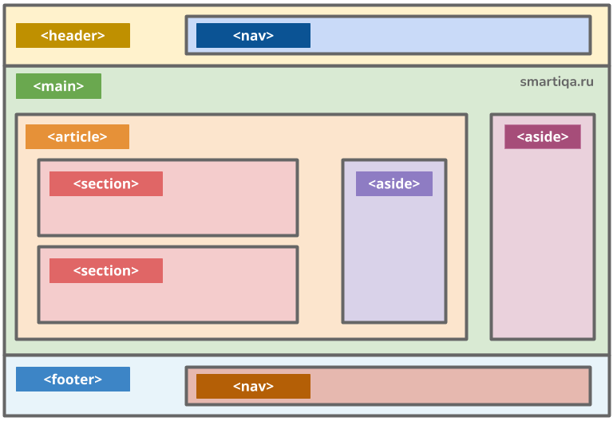

## Что такое семантика? Какие семантичные тэги вы знаете?

**Семантика** в контексте HTML и веб-разработки относится к значению и роли элементов (тэгов) в документе. Семантические тэги помогают браузерам, поисковым системам и разработчикам лучше понять структуру и содержание страницы. Это также улучшает доступность для людей с ограниченными возможностями, поскольку семантические элементы предоставляют информацию о том, как элементы страницы должны быть интерпретированы и представлены.

### Преимущества семантических тегов:

1. **Улучшение SEO**: Семантические тэги помогают поисковым системам лучше индексировать и ранжировать страницы.
2. **Повышение доступности**: Экранные считыватели и другие вспомогательные технологии могут лучше интерпретировать содержание.
3. **Читаемость кода**: Код становится более понятным для других разработчиков.

### Примеры семантических тегов:

1. **`<header>`**: Определяет заголовок страницы или секции.
2. **`<nav>`**: Используется для создания навигационного меню.
3. **`<main>`**: Означает основной контент документа, исключая заголовки, подзаголовки и боковые панели.
4. **`<article>`**: Представляет независимый кусок контента, который может быть опубликован отдельно (например, статьи, блоги).
5. **`<section>`**: Определяет раздел документа, который тематически связан, обычно имеет заголовок.
6. **`<aside>`**: Содержит дополнительный контент, который не связан напрямую с основным содержанием, например, боковые панели или заметки.
7. **`<footer>`**: Определяет нижний колонтитул для страницы или секции, часто содержит информацию об авторских правах, ссылки на политику конфиденциальности и т.д.
8. **`<figure>`**: Используется для обозначения иллюстраций, изображений, графиков или диаграмм с возможным подписью с помощью `<figcaption>`.
9. **`<time>`**: Используется для указания временной метки, даты или времени.
10. **`<mark>`**: Обозначает текст, который был выделен как важный или актуальный.

Использование семантических тегов делает ваш HTML более структурированным и понятным, как для машин, так и для людей, что способствует более лучшему восприятию и взаимодействию с содержанием.

