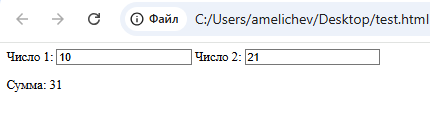

## Что такое элемент `<output>` в HTML5?

Элемент `<output>` в HTML5 — это семантический элемент, предназначенный для отображения результата вычислений или действий, выполняемых на веб-странице. Этот элемент особенно полезен в формах, где нужно отобразить результат в зависимости от ввода пользователя, например, сумму значений, итоги расчета или результаты проверки данных.

### Основные особенности `<output>`

- **Отображение динамических данных**: `<output>` обычно используется для отображения данных, которые меняются в зависимости от взаимодействия пользователя с формой или действия скрипта.
- **Атрибут `for`**: Можно использовать, чтобы связать `<output>` с другими элементами формы по их `id`, что делает его семантически связанным с этими элементами.
- **Атрибут `name`**: Подобно другим элементам формы, `<output>` может иметь атрибут `name`, который может быть использован при отправке формы.
- **Доступность**: Этот элемент улучшает доступность, так как помогает явно показать пользователю результат вычислений или ввода.

### Пример использования `<output>`

Предположим, что у нас есть форма для ввода чисел, и `<output>` будет отображать их сумму.

```html
<form oninput="result.value=parseInt(a.value) + parseInt(b.value)">
  <label for="a">Число 1:</label>
  <input type="number" id="a" name="a" value="0">
  
  <label for="b">Число 2:</label>
  <input type="number" id="b" name="b" value="0">
  
  <p>Сумма: <output name="result" for="a b" id="result">0</output></p>
</form>
```



### Как это работает:

- **Атрибут `for`**: Указывает, какие поля формы влияют на `<output>`. В примере это `id` полей `a` и `b`.
- **Реакция на изменения**: Когда значения `a` или `b` изменяются, событие `oninput` автоматически пересчитывает результат и выводит его в `<output>`.
  
### Когда использовать `<output>`

- **Формы с вычисляемыми значениями**: Когда требуется показывать результат на основе введенных данных.
- **Интерактивные приложения**: Для отображения данных, обновляемых в реальном времени, таких как калькуляторы, анкеты с итоговым баллом, формы с подсчетом оставшихся символов и т. д.

Элемент `<output>` улучшает семантику и доступность формы, обеспечивая более наглядное представление результатов или расчетов для пользователя.