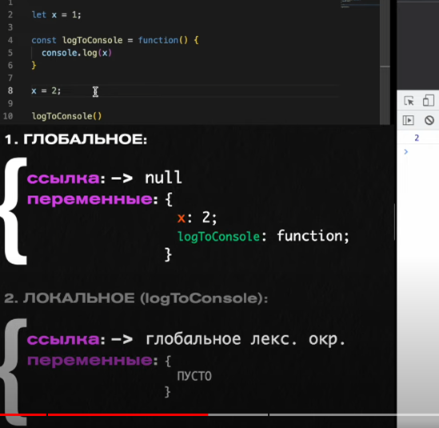

## Что такое замыкание (Closure)?

**Замыкание (Closure)** в JavaScript — это функция, которая «запоминает» свое лексическое окружение, то есть область видимости, в которой она была создана, даже после того, как эта область видимости перестала существовать. Другими словами, замыкание позволяет функции доступ к переменным из внешней функции даже после завершения выполнения этой внешней функции.

Лексическое окружение это не видимый объект, который создается автоматически, он состоит из переменных и ссылки на родительское окружение.



### Как это работает

Когда функция создается внутри другой функции, она может «захватить» переменные из внешней функции. Эти переменные остаются доступными для внутренней функции, даже если внешняя функция завершила выполнение.

### Пример замыкания:

```javascript
function outer() {
  let counter = 0;  // Переменная внешней функции
  
  function inner() {  // Внутренняя функция (замыкание)
    counter++;
    console.log(counter);
  }
  
  return inner;
}

const increment = outer();  // outer() возвращает внутреннюю функцию
increment();  // 1
increment();  // 2
increment();  // 3
```

### Объяснение:

1. Функция `outer` создаёт локальную переменную `counter` и возвращает функцию `inner`, которая имеет доступ к этой переменной.
2. После того как `outer()` завершила выполнение, переменная `counter` не исчезает, потому что функция `inner`, которая возвращается из `outer`, продолжает хранить ссылку на эту переменную. Это и есть замыкание.
3. Вызовы `increment()` увеличивают значение `counter`, так как `inner` продолжает иметь доступ к переменной `counter` из области видимости `outer`.

### Практическое использование замыканий

Замыкания часто используются для:

- **Создания приватных переменных**:
  В JavaScript нет встроенной поддержки для создания полностью приватных переменных, но замыкания могут помочь добиться этого.

  ```javascript
  function createCounter() {
    let count = 0;
    
    return {
      increment() {
        count++;
        return count;
      },
      decrement() {
        count--;
        return count;
      }
    };
  }

  const counter = createCounter();
  console.log(counter.increment());  // 1
  console.log(counter.decrement());  // 0
  ```

- **Функции обратного вызова (callbacks)**:
  Замыкания часто используются в асинхронных функциях, таких как таймеры или обработчики событий.

  ```javascript
  function sayHello(name) {
    setTimeout(function() {
      console.log(`Hello, ${name}`);
    }, 1000);
  }

  sayHello("Alice");  // Через 1 секунду выведет "Hello, Alice"
  ```

### Преимущества замыканий:
- Они позволяют создавать функции с доступом к приватным данным.
- Обеспечивают доступ к переменным даже после того, как их область видимости перестала существовать.
- Используются для сохранения состояния в функциях, когда необходимо «запомнить» данные.

### Заключение

Замыкание — это мощный инструмент в JavaScript, который позволяет сохранять контекст выполнения и обеспечивать доступ к данным после завершения их области видимости. Это основа для многих продвинутых конструкций в JavaScript, таких как модули, обработчики событий и колбэки.

Простое и частое использование замыканий — это создание приватных данных и функций, которые не доступны напрямую, но могут быть изменены через определённые методы. Например, счётчик или приватная переменная в объекте.

### Пример 1: Кэширование результатов вычислений

Замыкания можно использовать для кэширования данных, чтобы не выполнять одни и те же вычисления несколько раз:

```javascript
function createCache() {
  const cache = {};  // Приватный кэш
  
  return function(key, value) {
    if (value !== undefined) {
      cache[key] = value;  // Добавляем в кэш
    }
    return cache[key];  // Возвращаем значение из кэша
  };
}

const cache = createCache();
cache('a', 100);  // Сохраняем значение 100 под ключом 'a'
console.log(cache('a'));  // 100
console.log(cache('b'));  // undefined (такого ключа нет)

```

### Объяснение:
- Здесь функция createCache создаёт объект cache, который хранит значения. Внешний код может добавлять значения в кэш и запрашивать их через возвращаемую функцию.
- Замыкание позволяет сохранить и использовать кэш в разных вызовах функции.

### Пример 2: Настройка приватных данных

Замыкания также можно использовать для защиты данных и управления доступом к ним:

```javascript
function createUser(name) {
  let score = 0;  // Приватная переменная, которая недоступна напрямую
  
  return {
    getName() {
      return name;
    },
    incrementScore() {
      score++;
    },
    getScore() {
      return score;
    }
  };
}

const user = createUser("Alice");

console.log(user.getName());  // "Alice"
user.incrementScore();
user.incrementScore();
console.log(user.getScore());  // 2
```

### Объяснение:
- Здесь замыкание позволяет скрыть переменную `score` внутри функции `createUser`. Она доступна только через методы `incrementScore` и `getScore`.
- Внешний код не может напрямую изменить `score`, он может взаимодействовать с ней только через специально определённые методы.

### Пример 3: Таймер с замыканием

Ещё одно практическое применение замыкания — это создание таймеров, которые сохраняют состояние:

```javascript
function startTimer() {
  let seconds = 0;  // Приватная переменная
  
  setInterval(function() {
    seconds++;
    console.log(`Прошло ${seconds} секунд`);
  }, 1000);  // Обновляем каждую секунду
}

startTimer();  // Каждую секунду будет выводиться количество секунд
```

### Объяснение:
- В этом примере функция внутри `setInterval` создаёт замыкание над переменной `seconds` и будет увеличивать её каждую секунду.