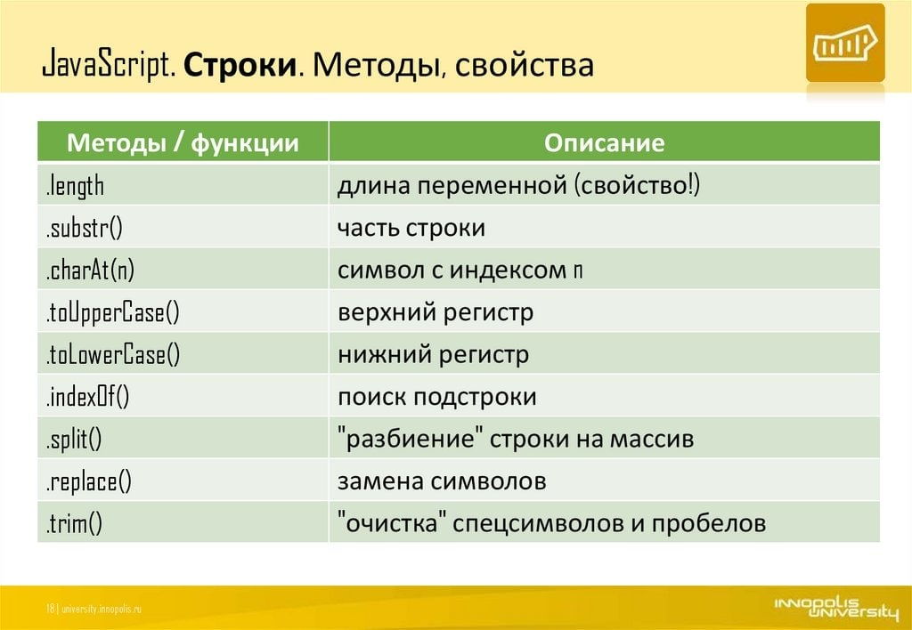

## Методы строк в JavaScript?

В JavaScript существует множество методов для работы со строками. Вот основные из них, сгруппированные по типам действий:

### 1. **Основные методы**

- **`charAt(index)`**: Возвращает символ по указанному индексу.
  ```javascript
  const str = "Hello";
  console.log(str.charAt(1));  // "e"
  ```

- **`length`**: Возвращает длину строки.
  ```javascript
  console.log(str.length);  // 5
  ```

- **`concat(...strings)`**: Объединяет две или более строк.
  ```javascript
  const str1 = "Hello";
  const str2 = "World";
  console.log(str1.concat(" ", str2));  // "Hello World"
  ```

### 2. **Изменение строк**

- **`toUpperCase()`**: Преобразует строку в верхний регистр.
  ```javascript
  console.log(str.toUpperCase());  // "HELLO"
  ```

- **`toLowerCase()`**: Преобразует строку в нижний регистр.
  ```javascript
  console.log(str.toLowerCase());  // "hello"
  ```

- **`trim()`**: Удаляет пробелы с начала и конца строки.
  ```javascript
  const strWithSpaces = "  Hello  ";
  console.log(strWithSpaces.trim());  // "Hello"
  ```

### 3. **Поиск и извлечение**

- **`indexOf(searchValue, fromIndex)`**: Возвращает индекс первого вхождения подстроки или -1, если не найдено.
  ```javascript
  console.log(str.indexOf("l"));  // 2
  ```

- **`lastIndexOf(searchValue, fromIndex)`**: Возвращает индекс последнего вхождения подстроки.
  ```javascript
  console.log(str.lastIndexOf("l"));  // 3
  ```

- **`substring(startIndex, endIndex)`**: Возвращает подстроку между двумя индексами.
  ```javascript
  console.log(str.substring(1, 4));  // "ell"
  ```

- **`slice(startIndex, endIndex)`**: Похож на `substring`, но поддерживает отрицательные индексы.
  ```javascript
  console.log(str.slice(1, 4));  // "ell"
  console.log(str.slice(-3));     // "llo"
  ```

- **`split(separator, limit)`**: Разделяет строку на массив подстрок, используя заданный разделитель.
  ```javascript
  const sentence = "Hello World";
  console.log(sentence.split(" "));  // ["Hello", "World"]
  ```

### 4. **Замена и регулярные выражения**

- **`replace(searchValue, newValue)`**: Заменяет первое вхождение подстроки или регулярного выражения.
  ```javascript
  const newStr = str.replace("l", "L");
  console.log(newStr);  // "HeLlo"
  ```

- **`replaceAll(searchValue, newValue)`**: Заменяет все вхождения подстроки или регулярного выражения (доступно с ES2021).
  ```javascript
  const anotherStr = "Hello Hello";
  console.log(anotherStr.replaceAll("Hello", "Hi"));  // "Hi Hi"
  ```

### 5. **Шаблонные строки**

- **`template literals`**: Используются для создания многострочных строк и интерполяции выражений.
  ```javascript
  const name = "Alice";
  const greeting = `Hello, ${name}!`;  // "Hello, Alice!"
  ```

### 6. **Другие полезные методы**

- **`includes(searchValue)`**: Проверяет, содержит ли строка указанную подстроку.
  ```javascript
  console.log(str.includes("Hello"));  // true
  ```

- **`startsWith(searchValue)`**: Проверяет, начинается ли строка с указанной подстроки.
  ```javascript
  console.log(str.startsWith("He"));  // true
  ```

- **`endsWith(searchValue)`**: Проверяет, заканчивается ли строка указанной подстрокой.
  ```javascript
  console.log(str.endsWith("lo"));  // true
  ```

### Примеры использования

```javascript
const text = "  JavaScript is fun!  ";

// Удаляем пробелы и преобразуем в верхний регистр
const trimmedText = text.trim().toUpperCase();
console.log(trimmedText);  // "JAVASCRIPT IS FUN!"

// Проверяем, начинается ли строка с "J"
console.log(trimmedText.startsWith("J"));  // true

// Разделяем строку на слова
const words = trimmedText.split(" ");
console.log(words);  // ["JAVASCRIPT", "IS", "FUN!"]
```

Эти методы позволяют эффективно обрабатывать и манипулировать строками в JavaScript.

