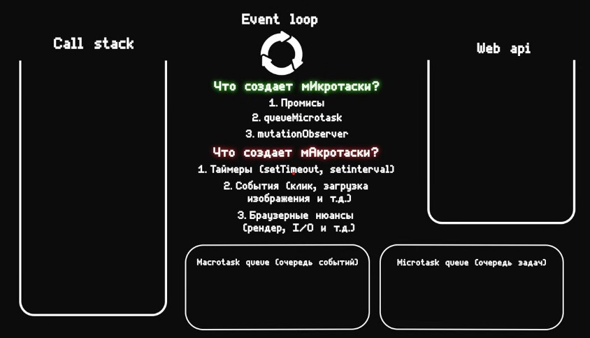
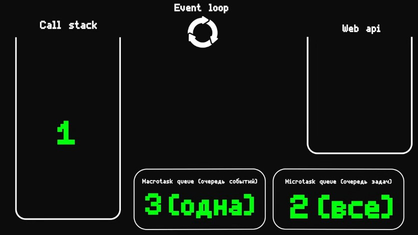

## Что такое цикл событий (event loop) и как он работает?

**Цикл событий (event loop)** — это механизм в JavaScript, который позволяет обрабатывать асинхронные операции и событийные сообщения. Он является основой для работы с асинхронностью в JavaScript, обеспечивая выполнение кода, сбор и обработку событий, а также выполнение кода по очереди.

### Как работает цикл событий:

1. **Стек вызовов (Call Stack)**:
   - Когда JavaScript выполняет код, он помещает функции в стек вызовов. Когда функция завершает выполнение, она удаляется из стека.
   - Если стек вызовов пуст, JavaScript может продолжить выполнение кода, находящегося в очереди.

2. **Очередь сообщений (Task Queue)**:
   - Асинхронные операции, такие как обработчики событий, таймеры (setTimeout, setInterval) и другие операции, добавляют свои колбэки в очередь сообщений.
   - Эти колбэки ждут своей очереди для выполнения, когда стек вызовов станет пустым.

3. **Цикл событий (Event Loop)**:
   - Цикл событий постоянно проверяет, пуст ли стек вызовов.
   - Если стек вызовов пуст, он берет следующий колбэк из очереди сообщений и помещает его в стек вызовов для выполнения.
   - Этот процесс повторяется бесконечно, что позволяет JavaScript обрабатывать асинхронные операции и события.

### Пример работы:

```javascript
console.log('Start');

setTimeout(() => {
    console.log('Timeout 1');
}, 0);

setTimeout(() => {
    console.log('Timeout 2');
}, 0);

console.log('End');
```

**Вывод:**
```
Start
End
Timeout 1
Timeout 2
```

### Объяснение:
1. **`console.log('Start')`** помещается в стек вызовов и выполняется, выводя "Start".
2. Затем выполняется **`setTimeout`**, который добавляет колбэк в очередь сообщений, но выполнение не приостанавливается.
3. **`console.log('End')`** снова помещается в стек вызовов и выполняется, выводя "End".
4. Когда стек вызовов становится пустым, цикл событий берет первый колбэк из очереди сообщений и помещает его в стек, который выводит "Timeout 1".
5. Затем выполняется второй колбэк, выводя "Timeout 2".

### Заключение:
Цикл событий позволяет JavaScript обрабатывать асинхронные операции и события без блокировки основного потока выполнения. Это делает JavaScript подходящим для создания отзывчивых веб-приложений, которые могут обрабатывать множество событий и операций, не приостанавливая взаимодействие с пользователем.




`queueMicrotask` — это метод в JavaScript, который добавляет функцию в **очередь микрозадач** (microtask queue). Микрозадачи выполняются сразу после текущего выполнения кода (синхронного кода) и перед выполнением задач из **очереди макрозадач** (macro task queue), таких как `setTimeout` или `setInterval`.

### **Основные характеристики `queueMicrotask`**
1. **Добавляет функцию в микрозадачу**: Функция передается в очередь микрозадач и выполняется после завершения текущего синхронного кода.
2. **Приоритет выполнения**: Микрозадачи выполняются раньше макрозадач, что делает их полезными для задач, которые нужно выполнить как можно быстрее, но асинхронно.
3. **Легковесная альтернатива другим методам**: 
   - `queueMicrotask` проще и быстрее, чем использование промисов (`Promise.resolve().then()`), так как не требует создания объекта `Promise`.

---

### **Синтаксис**
```javascript
queueMicrotask(callback);
```

- `callback`: Функция, которая будет выполнена в очереди микрозадач.

---

### **Пример использования**
```javascript
console.log("Start");

queueMicrotask(() => {
    console.log("Microtask 1");
});

console.log("End");

// Вывод:
// Start
// End
// Microtask 1
```

Здесь:
1. Сначала выполняется весь синхронный код.
2. Функция из `queueMicrotask` выполняется после завершения синхронного кода.

---

`MutationObserver` — это встроенный в JavaScript API, который позволяет отслеживать изменения в DOM (Document Object Model). С помощью него можно наблюдать за изменениями атрибутов, содержимого элементов, добавлением или удалением дочерних узлов и выполнять пользовательский код в ответ на эти изменения.

---

### **Основные характеристики `MutationObserver`**
1. **Позволяет следить за изменениями DOM**:
   - Изменение текста или HTML внутри элемента.
   - Изменение атрибутов элемента.
   - Добавление или удаление дочерних элементов.

2. **Асинхронное уведомление**:
   - Изменения фиксируются, а затем уведомления о них отправляются в виде "пакета" (batched) в отдельной итерации цикла событий.

3. **Высокая гибкость**:
   - Можно настроить, за какими именно изменениями следить.

---

### **Как работает `MutationObserver`**

1. Создайте новый экземпляр `MutationObserver`, передав функцию обратного вызова (callback).
2. Свяжите его с целевым элементом и настройте параметры наблюдения (что именно нужно отслеживать).
3. Используйте его для обработки изменений, когда они происходят.

---

### **Синтаксис**
```javascript
const observer = new MutationObserver(callback);

// Подключение наблюдателя к элементу:
observer.observe(targetNode, config);

// Отключение наблюдения:
observer.disconnect();

// Сброс записей изменений:
const records = observer.takeRecords();
```

- **`callback`**: Функция, которая вызывается, когда фиксируются изменения.
- **`targetNode`**: DOM-элемент, за которым нужно наблюдать.
- **`config`**: Объект с настройками наблюдения.

---

https://youtu.be/zDlg64fsQow?si=-hhZQ7lp7kTqPhd-