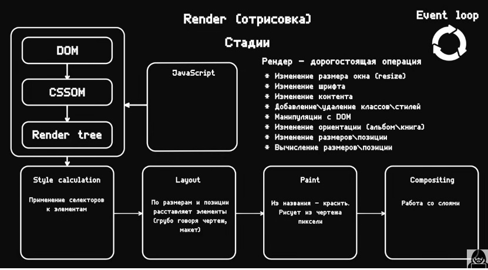

## Cтадии рендера отрисовки страницы?

Процесс рендера (отрисовки) веб-страницы в браузере состоит из нескольких стадий. Эти этапы определяют, как браузер преобразует HTML, CSS, JavaScript и другие ресурсы в визуально отображаемую страницу. Рассмотрим основные стадии рендера:

---

### **1. Обработка HTML и создание DOM (Document Object Model)**

1. Браузер начинает загрузку HTML-документа.
2. По мере чтения HTML, создаётся дерево **DOM** — иерархическая структура, представляющая HTML-документ в памяти.
   - Включает узлы элементов (`<div>`, `<p>`), атрибуты (`class`, `id`) и текстовые узлы.
3. Если в HTML встречаются внешние ресурсы (например, `<script>` или `<link>`), браузер может начать их загрузку.

---

### **2. Обработка CSS и создание CSSOM (CSS Object Model)**

1. Браузер обрабатывает CSS, загружая внутренние (`<style>`) и внешние (`<link rel="stylesheet">`) стили.
2. Создаётся дерево **CSSOM** — структура, описывающая стили, применяемые к элементам DOM.
   - CSSOM и DOM существуют отдельно, чтобы позже объединиться.

---

### **3. Построение рендера-дерева (Render Tree)**

1. **Рендер-дерево** создаётся путём объединения DOM и CSSOM.
   - Это дерево содержит только видимые элементы, игнорируя те, которые имеют, например, `display: none`.
2. Каждый элемент в рендер-дереве содержит визуальную информацию: размеры, стили, положение.

---

### **4. Вычисление макета (Layout/Reflow)**

1. Браузер рассчитывает размеры и положение каждого элемента рендер-дерева.
   - Учитываются свойства, такие как `width`, `height`, `margin`, `padding`, `position`, и зависимости от других элементов (например, `flex` или `grid`).
2. Макет (или поток) определяет, где и как каждый элемент будет отображаться на странице.

---

### **5. Растеризация и отрисовка (Painting)**

1. После вычисления макета браузер приступает к отрисовке.
2. Каждый элемент рендер-дерева преобразуется в пиксели на экране.
   - Учитываются стили: цвета, фоны, границы, тени и изображения.
3. Эта фаза известна как **"painting"** (рисование).

---

### **6. Композитинг (Compositing)**

1. Если страница использует сложные элементы (например, слои, анимации, трансформации), браузер разбивает её на отдельные слои.
2. Затем браузер объединяет слои в итоговое изображение для отображения.
   - Это важно для GPU-ускорения.

---

### **Взаимодействие с JavaScript**

#### Влияние JavaScript на рендеринг:
1. **Блокировка DOM-парсинга**:
   - Синхронные скрипты (`<script>` без атрибута `async` или `defer`) приостанавливают разбор HTML до завершения их загрузки и выполнения.
2. **Изменение DOM и CSSOM**:
   - JavaScript может изменять DOM и CSSOM через API, что вызывает:
     - **Reflow** (перерасчёт макета).
     - **Repaint** (перерисовка элементов).
   - Например:
     ```javascript
     const div = document.createElement('div');
     div.style.width = '100px';
     div.style.height = '100px';
     document.body.appendChild(div);
     ```

---

### **Оптимизация рендера**

1. **Минимизируйте изменения в DOM**:
   - Изменение DOM может вызывать перерасчёты макета и перерисовку.
   - Используйте **DocumentFragment** или минимизируйте количество операций с DOM.

2. **Используйте GPU-ускорение**:
   - Свойства, такие как `transform`, `opacity`, используют GPU для рендера, что ускоряет работу.

3. **Отложенная загрузка ресурсов**:
   - Используйте `async` или `defer` для загрузки JavaScript.
   - Оптимизируйте загрузку изображений с помощью `lazy-loading`.

4. **Объединяйте и сжимайте CSS и JavaScript**:
   - Уменьшение количества запросов и размера файлов ускоряет загрузку и обработку.

---

### **Итоговая схема:**

1. **HTML -> DOM**
2. **CSS -> CSSOM**
3. **DOM + CSSOM -> Render Tree**
4. **Render Tree -> Layout**
5. **Layout -> Paint**
6. **Paint -> Composite**

Каждый этап может быть оптимизирован для повышения производительности страницы.

