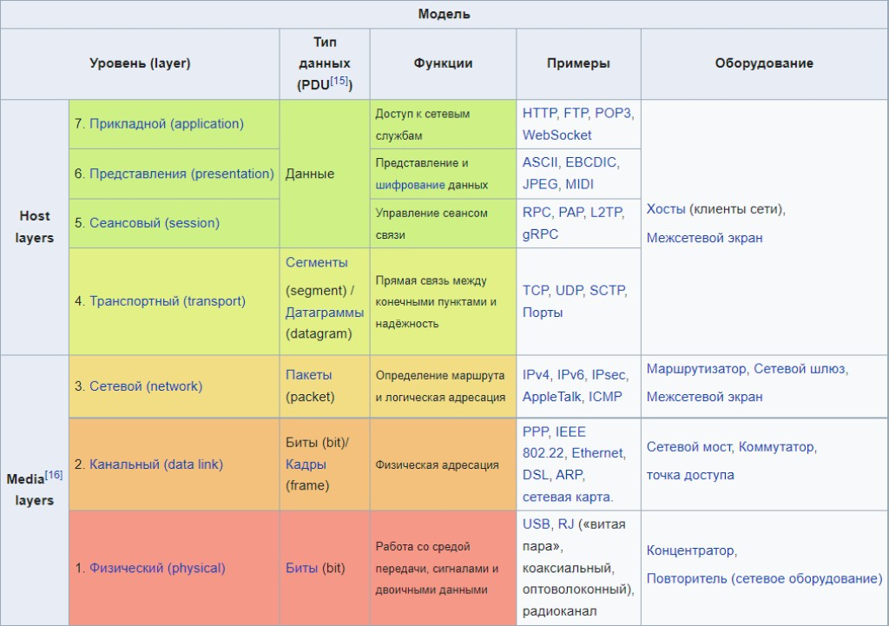

## Что такое OSI модель?

**Модель OSI (Open Systems Interconnection)** — это эталонная модель взаимодействия открытых систем, предложенная Международной организацией по стандартизации (ISO). Она описывает, как данные передаются по сети от одного устройства к другому, разделяя эту задачу на семь уровней. Каждый уровень модели OSI выполняет определенные функции и взаимодействует с вышележащим и нижележащим уровнями, упрощая диагностику сетевых проблем и разработку сетевых технологий.

### 7 уровней модели OSI

1. **Физический уровень (Physical Layer)**
   - **Функция**: Определяет физические характеристики оборудования и канала связи, такие как тип кабелей, разъемы, электрические и оптические сигналы.
   - **Примеры**: Ethernet-кабели, Wi-Fi, модемы, радиоволны.
   - **Основные протоколы и устройства**: USB, Ethernet, Bluetooth, физические разъемы, сетевые адаптеры.

2. **Канальный уровень (Data Link Layer)**
   - **Функция**: Обеспечивает надежную передачу данных по физической линии связи. Разбивает данные на кадры (frames) и контролирует их доставку, исправляет ошибки, возникшие на физическом уровне.
   - **Примеры**: Ethernet (кадры), MAC-адреса (управление доступом к среде).
   - **Основные протоколы и устройства**: Ethernet, PPP, коммутаторы, MAC-адреса.

3. **Сетевой уровень (Network Layer)**
   - **Функция**: Определяет маршрутизацию данных и обеспечивает их передачу между разными сетями. Обеспечивает логическую адресацию и маршрутизацию пакетов данных.
   - **Примеры**: IP-адреса, маршрутизация.
   - **Основные протоколы и устройства**: IP, ICMP, маршрутизаторы.

4. **Транспортный уровень (Transport Layer)**
   - **Функция**: Обеспечивает надежную передачу данных между устройствами и управляет разбиением данных на пакеты и их сборкой. Контролирует поток данных, проверяет их целостность и может выполнять повторную отправку.
   - **Примеры**: TCP (гарантированная доставка), UDP (без гарантии доставки).
   - **Основные протоколы и устройства**: TCP, UDP.

5. **Сеансовый уровень (Session Layer)**
   - **Функция**: Управляет сессиями или соединениями между устройствами. Открывает, закрывает и синхронизирует взаимодействие между приложениями.
   - **Примеры**: Сессии в видеозвонках или при работе с базами данных.
   - **Основные протоколы и устройства**: PPTP, RPC, сокеты.

6. **Уровень представления (Presentation Layer)**
   - **Функция**: Обеспечивает преобразование данных, чтобы приложения могли корректно их интерпретировать. Выполняет шифрование, сжатие, преобразование форматов данных.
   - **Примеры**: Кодирование UTF-8, шифрование SSL/TLS.
   - **Основные протоколы и устройства**: SSL/TLS, JPEG, MPEG, ASCII.

7. **Прикладной уровень (Application Layer)**
   - **Функция**: Предоставляет интерфейс для взаимодействия пользователей и приложений с сетью. Определяет способы доступа к данным и их представления на уровне приложений.
   - **Примеры**: Электронная почта, браузеры, протоколы FTP, HTTP.
   - **Основные протоколы и устройства**: HTTP, FTP, SMTP, DNS.

### Как работают уровни OSI

Каждый уровень OSI получает данные от вышестоящего уровня и добавляет к ним необходимую информацию (так называемую "служебную информацию") для обеспечения своей функции. Этот процесс называется **инкапсуляцией**. Например, транспортный уровень добавляет номер порта, сетевой уровень — IP-адрес, а канальный — MAC-адрес.

При приеме данных процесс идет в обратном порядке: каждый уровень удаляет свою служебную информацию и передает данные на следующий, более высокий уровень, пока они не достигнут конечного приложения.

### Преимущества модели OSI

- **Стандартизация**: Модель позволяет стандартизировать процессы передачи данных и разработку сетевых технологий.
- **Модульность и гибкость**: Каждый уровень можно разрабатывать и улучшать независимо.
- **Упрощение диагностики**: Ошибки в сети можно быстрее находить и решать, анализируя уровни модели OSI.
  
### Заключение

Модель OSI — это теоретическая концепция, которая упрощает понимание взаимодействия сетевых компонентов. Хотя на практике широко используется стек протоколов TCP/IP, модель OSI остается важной для обучения, проектирования сетей и диагностики сетевых проблем.

