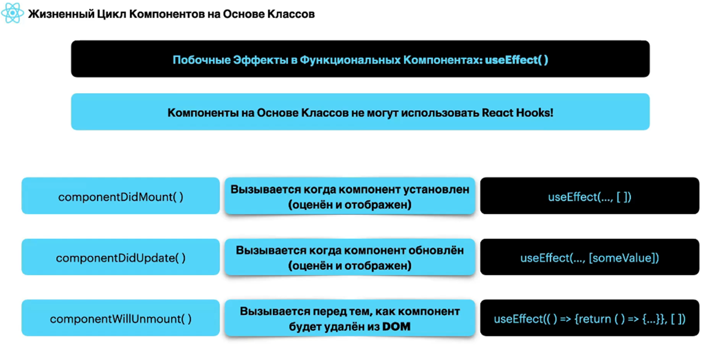

## Что Такое JSX?

JSX (JavaScript XML) — это синтаксическое расширение для JavaScript, используемое в React для описания интерфейсов пользовательских компонентов. Он позволяет писать HTML-подобный код непосредственно в JavaScript, что делает код более читабельным и интуитивно понятным.

### Основные характеристики JSX

1. **Синтаксис**:
   JSX выглядит как HTML, но на самом деле это синтаксический сахар для вызова функции `React.createElement()`. Например:
   ```javascript
   const element = <h1>Hello, world!</h1>;
   ```

   Этот код преобразуется в:
   ```javascript
   const element = React.createElement('h1', null, 'Hello, world!');
   ```

2. **Вложенные элементы**:
   JSX позволяет легко создавать вложенные структуры:
   ```javascript
   const element = (
     <div>
       <h1>Hello, world!</h1>
       <p>This is a paragraph.</p>
     </div>
   );
   ```

3. **Выражения**:
   Вы можете вставлять JavaScript-выражения в JSX, обернув их в фигурные скобки:
   ```javascript
   const name = 'Alice';
   const element = <h1>Hello, {name}!</h1>;
   ```

4. **Атрибуты**:
   Вы можете задавать атрибуты в JSX, используя camelCase для имен (например, `className` вместо `class`):
   ```javascript
   const element = ;
   ```

5. **Компоненты**:
   JSX позволяет использовать пользовательские компоненты как теги:
   ```javascript
   const App = () => <h1>Hello, world!</h1>;
   ```

### Преимущества использования JSX

1. **Читаемость**: JSX делает код более понятным, так как визуально он похож на HTML.
2. **Интеграция с JavaScript**: Позволяет легко интегрировать логику и разметку, что упрощает создание динамических интерфейсов.
3. **Поддержка инструментов**: JSX поддерживается современными инструментами разработки и компиляторами, такими как Babel, что позволяет преобразовывать его в стандартный JavaScript.

### Пример использования JSX

```javascript
import React from 'react';

const App = () => {
  const name = 'Alice';
  return (
    <div>
      <h1>Hello, {name}!</h1>
      <p>This is a simple example of JSX.</p>
    </div>
  );
};

export default App;
```

В этом примере мы создаём компонент `App`, который рендерит заголовок и параграф, используя JSX для описания структуры разметки.

### Заключение

JSX является важным элементом React, упрощая создание интерфейсов и делая код более выразительным и поддерживаемым.