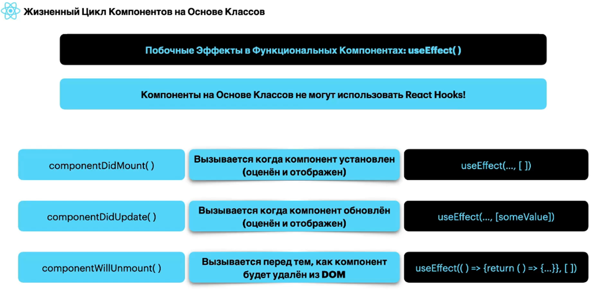

## Стадии жизненного цикла компонента в React?

Жизненный цикл компонента в React можно разбить на несколько стадий, каждая из которых соответствует определённым этапам существования компонента: от создания до удаления. Вот основные стадии жизненного цикла компонента:

### 1. Стадия монтирования (Mounting)
На этой стадии компонент создаётся и добавляется в DOM.

- **Методы жизненного цикла**:
  - **`constructor`**: Инициализация состояния и привязка методов.
  - **`static getDerivedStateFromProps`**: Позволяет обновлять состояние на основе изменившихся пропсов.
  - **`render`**: Отображает JSX.
  - **`componentDidMount`**: Вызывается сразу после монтирования, идеально подходит для выполнения сетевых запросов или инициализации сторонних библиотек.

### 2. Стадия обновления (Updating)
Компонент обновляется при изменении пропсов или состояния.

- **Методы жизненного цикла**:
  - **`static getDerivedStateFromProps`**: Аналогично монтированию, обновляет состояние на основе новых пропсов.
  - **`shouldComponentUpdate`**: Позволяет оптимизировать обновление компонента, возвращая `true` или `false`.
  - **`render`**: Отображает обновлённое состояние.
  - **`componentDidUpdate`**: Вызывается после обновления, позволяет выполнять дополнительные действия, основанные на предыдущих пропсах или состоянии.

### 3. Стадия размонтирования (Unmounting)
На этой стадии компонент удаляется из DOM.

- **Методы жизненного цикла**:
  - **`componentWillUnmount`**: Позволяет очистить ресурсы, такие как отмена подписок или таймеров, перед удалением компонента.

### Примечания по использованию хуков

В функциональных компонентах с использованием хуков жизненный цикл можно контролировать с помощью хука `useEffect`, который может воспроизводить поведение различных методов жизненного цикла:

- **`useEffect`**:
  - Если передать массив зависимостей, хук будет срабатывать при изменении значений в этом массиве, что имитирует поведение обновления.
  - Если массив зависимостей пуст, хук будет срабатывать только один раз после монтирования, аналогично `componentDidMount`.
  - Функция очистки внутри `useEffect` выполняется перед размонтированием компонента, что аналогично `componentWillUnmount`.

### Заключение
Стадии жизненного цикла компонента позволяют разработчикам управлять поведением компонентов на каждом этапе их существования. Понимание этих стадий помогает создавать более эффективные и предсказуемые приложения на React.

